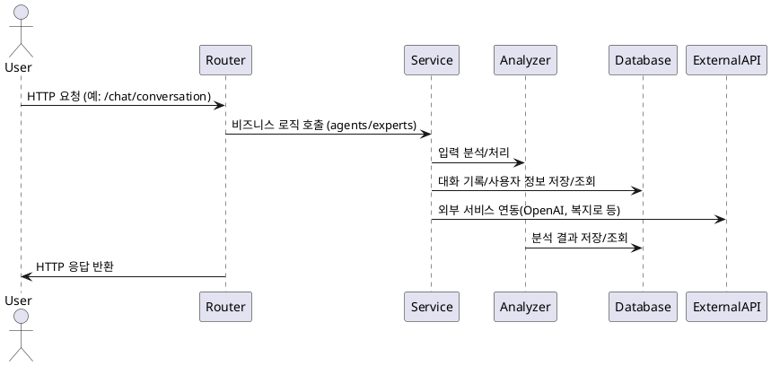

# 장애인 복지 AI 챗봇 API

## 프로젝트 개요
- 장애인 복지 정보 및 상담을 제공하는 AI 챗봇 백엔드 API 서버
- 주요 기능: 대화형 질의응답, 전문가 추천, 정책/복지 정보 검색, 대화 이력 분석, 복지 혜택 분석, 외부 API 연동
- 기술 스택: Python, FastAPI, Pydantic, MongoDB, OpenAI API 등

## 설치 및 실행 방법
1. 의존성 설치
   ```bash
   pip install -r requirements.txt
   ```
2. 환경 변수 설정
   - `.env.example` 파일 참고하여 `.env` 파일 생성 및 환경 변수 입력
3. 서버 실행
   ```bash
   uvicorn app.main:app --reload
   ```

## API 문서 접근 방법
- Swagger UI: [http://localhost:8000/docs](http://localhost:8000/docs)
- OpenAPI 명세(JSON): [http://localhost:8000/openapi.json](http://localhost:8000/openapi.json)

### 주요 엔드포인트 요약
| HTTP 메서드 | 경로                | 기능 설명                                   |
|-------------|---------------------|---------------------------------------------|
| POST        | /chat/start         | 대화 시작, 전문가 카드 목록 및 인사 반환     |
| POST        | /chat/expert        | 특정 전문가(정책, 취업 등) 질의응답         |
| POST        | /chat/conversation  | 일반/전문가 대화(대화 이력 기반)            |
| POST        | /analyze/benefits   | 사용자/구직 정보 기반 복지 혜택 분석        |
| GET         | /                   | 서버 상태 확인(헬스체크)                    |

## 아키텍처 다이어그램
- 주요 컴포넌트 및 데이터 흐름:



## 문서 참조 가이드
- 상세 리팩토링 및 구조 분석: `app/doc/리팩토링_분석.md`
- 환경 변수 예시: `.env.example`
- 기타 문서: `docs/`, `scripts/` 등

## 기여 방법
- 코드/문서 기여: Pull Request 제출 전, 코드 스타일 및 문서화 표준 준수
- 이슈/버그 제보: GitHub Issues 활용
- 문의/기여 가이드: `CONTRIBUTING.md`(추가 예정) 참고 