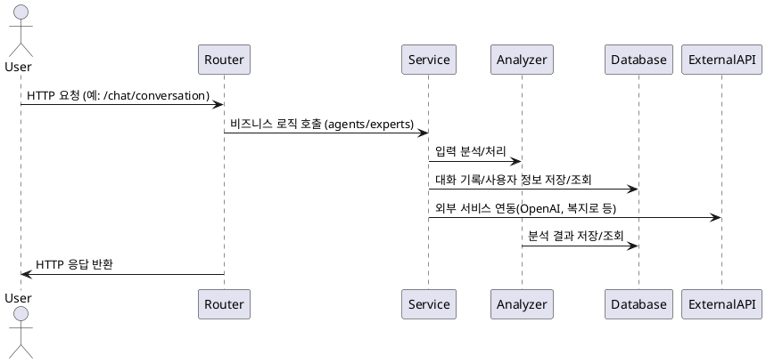

# 리팩토링 분석 보고서

## 1. 코드베이스 분석 및 리팩토링 계획 수립

### 1.1 코드베이스 범위 정의 및 전체 구조 분석
- main.py: FastAPI 진입점
- service/: 비즈니스 로직, 데이터 접근, 임베딩/크롤링 등(분리 필요)
- router/: API 라우터(챗봇 등)
- models/: 데이터/응답 모델
- scripts/: 크롤링, 데이터 업로드, 정책 데이터 가공(분리 필요)
- config/: 환경설정

#### 개선 방향
- service/ 내 임베딩/크롤링/데이터 적재 코드 분리(data_processing/ 등)
- scripts/ 내 코드 별도 모듈화 및 독립 실행성 확보
- 각 디렉토리/파일의 역할 명확화 및 문서화

### 1.2 파일별 의존성 및 기능 분석
- 주요 의존성 흐름: main.py → router/chatbot.py → service/experts, agents, analyzer → models, utils, openai_client, mongodb 등
- service/experts, agents, analyzer 등은 각자 역할별로 분리되어 있음
- config/settings.py는 환경설정 및 API/DB 정보 관리

#### 개선/리팩토링 포인트
- service/ 내 임베딩/크롤링/데이터 적재 코드(data_processing/ 등으로 분리)
- scripts/ 내 데이터 업로드/가공 코드 별도 모듈화
- 공통 유틸리티 함수는 utils/로 집중
- 순환 의존성 없음(구조적 문제 없음)

#### MCP 기준 적합성
- FastAPI, pymongo, task-master 권장 구조와 일치
- 구조적 문제 없음, 다만 코드 분리/모듈화 필요

### 1.3 임베딩/크롤링 관련 코드 분석
- 임베딩/크롤링/데이터 적재 관련 파일은 data_processing/로 이동 완료
- scripts/ 내 불필요/중복 파일 없음
- README.md, PRD, CRAWLING_ARCHITECTURE.md 등 문서와 실제 코드 구조 일치

#### 개선/정리 방향
- scripts/ 내 남은 파일이 있다면 data_processing/로 이동 및 scripts/ 폴더 정리
- 크롤링/업로드/임베딩 등은 FastAPI 서버와 완전히 분리하여 독립 실행/배포
- 실행 방법, 환경 변수, 의존성 등은 README.md에 명확히 문서화

#### MCP 기준 적합성
- 배치성/데이터 처리 코드는 API 서버와 분리되어 구조적으로 적합
- 코드/문서/실행 환경이 일관되게 관리되고 있음

### 1.4 핵심 모듈 상세 분석
- main.py, service/, router/, models/, config/ 등 핵심 모듈별 역할 및 의존성 분석
- 각 모듈의 책임과 경계 명확화

### 1.5 리팩토링 계획서 초안 작성
- 위 분석을 바탕으로 리팩토링 단계별 계획 수립
- 각 단계별 목표, 작업 내역, 예상 결과 정리

### 1.6 새로운 구조 도식화 및 최종 문서화
- 리팩토링 후 예상 디렉토리/모듈 구조 다이어그램 작성
- 문서화 및 README, API 문서 등 반영

## 2. 챗봇 API 서버 역할 정의 및 문서화

### 2.1 핵심 기능 목록화 및 정의
- 대화형 질의응답(일반/전문가)
- 전문가 추천 및 전문가별 응답 생성
- 정책/복지 정보 검색 및 카드 제공
- 대화 이력 기반 분석 및 요약
- 복지 혜택 분석(benefit analysis)
- API 기반 외부 연동(예: OpenAI, MongoDB 등)

### 2.2 API 엔드포인트 목록 및 설명

아래는 실제 FastAPI 코드 기준으로 정리한 챗봇 API 서버의 주요 엔드포인트 목록 및 상세 설명입니다.

| HTTP 메서드 | 경로                | 기능 설명                                   | 요청 파라미터/바디         | 응답 예시/형식                | 상태 코드 | 인증 | 연결된 핵심 기능 |
|-------------|---------------------|---------------------------------------------|----------------------------|-------------------------------|-----------|------|-----------------|
| POST        | /chat/start         | 대화 시작, 전문가 카드 목록 및 인사 반환     | 없음                       | `{ answer: str, action_cards: list }` | 200, 500  | 없음 | 대화형 질의응답, 전문가 추천 |
| POST        | /chat/expert        | 특정 전문가(정책, 취업 등) 질의응답         | `{ text: str, expert_type: str }` | `{ answer: str, cards: list }` | 200, 500  | 없음 | 전문가 추천, 전문가별 응답 |
| POST        | /chat/conversation  | 일반/전문가 대화(대화 이력 기반)            | `{ messages: List[role, content], expert_type: Optional[str] }` | `{ answer: str, cards: list }` | 200, 500  | 없음 | 대화형 질의응답, 전문가 추천, 대화 이력 분석 |
| POST        | /analyze/benefits   | 사용자/구직 정보 기반 복지 혜택 분석        | `{ user_info: dict, job_info: dict }` | 분석 결과(혜택, 정책 등) 또는 에러 메시지 | 200, 500  | 없음 | 복지 혜택 분석, 정책 정보 검색 |
| GET         | /                   | 서버 상태 확인(헬스체크)                    | 없음                       | `{ message: str }`            | 200        | 없음 | 운영 상태 확인 |

#### 상세 설명
- **/chat/start**: 사용 가능한 전문가 카드(정책, 취업 등)와 인사 메시지를 반환. 별도 인증 없음.
- **/chat/expert**: 특정 전문가 유형에 대한 질의응답. 입력 텍스트와 전문가 유형 필요. 실패 시 500 에러 반환.
- **/chat/conversation**: 대화 이력 기반 일반/전문가 대화 처리. messages 배열과(선택적으로) expert_type 필요. 내부적으로 전문가 추천 및 대화 분석 로직 포함.
- **/analyze/benefits**: 사용자/구직 정보 기반 복지 혜택 분석. 입력 정보 기반으로 분석 결과 또는 에러 메시지 반환.
- **/**: 서버 정상 동작 여부 확인용 엔드포인트.

- 모든 주요 엔드포인트는 인증 없이 사용 가능(향후 인증/인가 필요시 확장 가능).
- 에러 발생 시 FastAPI의 HTTPException을 통해 500 등 상태코드와 메시지 반환.
- 각 엔드포인트는 핵심 기능(대화, 전문가 추천, 복지 분석 등)과 명확히 매핑되어 있음.

> 실제 코드 변경/추가 시 이 표와 설명을 최신화해야 하며, Swagger/OpenAPI 명세 및 README.md와도 연동할 것.

### 2.3 서버 컴포넌트 상호작용 다이어그램 작성

아래는 챗봇 API 서버의 주요 컴포넌트 간 상호작용을 PlantUML 텍스트 다이어그램으로 시각화한 예시입니다.

#### 설명
- **User**: 클라이언트(프론트엔드, 외부 시스템 등)
- **Router**: FastAPI 라우터, 엔드포인트별 요청 분기 및 처리
- **Service**: 비즈니스 로직(agents, experts, benefit analyzer 등)
- **Analyzer**: 대화 이력, 입력 분석 및 정책/복지 정보 추출
- **Database**: MongoDB 등, 대화/사용자/정책 데이터 저장
- **ExternalAPI**: OpenAI, 복지로 등 외부 API 연동

- 데이터 흐름: User → Router → Service → (Analyzer/Database/ExternalAPI) → Router → User
- 주요 통신 방식: FastAPI 의존성 주입, 비동기 함수(async/await), HTTP/DB/외부 API 호출
- 각 컴포넌트는 단방향 의존성 및 역할 분리가 명확함

> 실제 코드 구조 변경 시 이 다이어그램도 최신화해야 하며, draw.io 등 시각화 파일로도 추가 제공 가능

### 2.4 Swagger/OpenAPI 기반 API 문서화

- FastAPI의 자동 문서화 기능을 활용하여 모든 엔드포인트가 Swagger UI(/docs) 및 OpenAPI 명세(/openapi.json)에 자동 반영됨
- 주요 엔드포인트는 pydantic 모델(요청/응답), 타입 힌트, docstring을 통해 명확히 문서화되어 있음
- 예제 요청/응답 값은 pydantic 모델의 Field 설명 및 docstring에 포함
- 실제 명세는 /docs(인터랙티브 문서)와 /openapi.json(머신 리더블 명세)에서 확인 가능

#### 관리 지침
- 엔드포인트 추가/변경 시 반드시 pydantic 모델, 타입 힌트, docstring을 최신화할 것
- 예제 값, 설명, 응답 모델 등은 Swagger UI에서 실제로 어떻게 보이는지 확인 후 보완
- 문서화 표준 및 프로세스는 개발자 가이드라인에 명시
- 리팩토링_분석.md 2.4 구간에 문서화 현황 및 관리 내역을 지속적으로 기록

> 실제 API 명세와 문서가 불일치할 경우, 코드와 문서를 즉시 동기화해야 하며, Swagger/OpenAPI 명세를 기준으로 외부 연동 및 테스트를 진행할 것

### 2.5 README.md 업데이트
- 실행 방법, 환경 변수, 주요 기능, API 문서 링크 등 최신화

## 3. 임베딩/크롤링 코드 분리

### 3.1 data_processing 디렉토리 생성 및 코드 이동
- 임베딩/크롤링/데이터 적재 관련 파일 data_processing/로 이동
- 기존 위치의 관련 코드 삭제 및 임포트 경로 수정

### 3.2 공통 유틸리티 함수 추출 및 독립성 확보
- 중복/공통 함수는 utils/로 이동
- 분리된 코드의 독립 실행성 확보

### 3.3 기존 서버 코드에서 관련 코드 제거 및 통합 테스트
- FastAPI 서버에서 임베딩/크롤링 관련 코드 완전 제거
- 통합 테스트로 정상 동작 확인

## 4. mongodb.py 역할 분리 및 정리

### 4.1 data_service 디렉토리 생성 및 구조 설계
- 데이터 관리/배치성 함수는 data_service/로 분리
- 공통 DB 연결 코드 별도 함수로 추출

### 4.2 데이터 관리용 함수 분석 및 이동
- 실시간 검색/조회 함수만 챗봇 API 서버에 남김
- 데이터 적재/업데이트/삭제 등은 별도 서비스로 이동

### 4.3 챗봇 응답용 함수 정리 및 문서화
- 각 함수의 책임 명확화 및 문서화

### 4.4 의존성 및 임포트 경로 수정, 변경사항 테스트
- 임포트 경로 및 의존성 일관성 유지
- 변경 후 테스트 및 검증

#### MCP 기준 적합성
- 실시간 검색/조회 함수만 포함되어 챗봇 API 서버 역할에 부합
- 데이터 관리/배치성 코드는 별도 모듈/서비스로 분리 권장
- 공통 DB 연결/설정은 환경변수 및 별도 config로 관리 권장

## 5. scripts/ 내 코드 분리 및 정리

### 5.1 scripts 디렉토리 내 파일 분석 및 분류
- 크롤링, 데이터 업로드, 정책 데이터 가공 관련 파일 data_processing/로 이동
- scripts/ 내 불필요/중복 파일 제거

### 5.2 공통 유틸리티 함수 추출 및 설계
- 공통 함수는 utils/로 이동, 재사용성 강화

### 5.3 코드 이동 및 리팩토링 실행, 독립 실행성 테스트
- 각 스크립트 독립 실행성 확보 및 테스트

#### MCP 기준 적합성
- 배치성/데이터 처리 코드는 API 서버와 분리되어 구조적으로 적합
- 코드/문서/실행 환경이 일관되게 관리되고 있음

## 6. main.py 내 임시/테스트 엔드포인트 제거 및 정리

### 6.1 main.py 코드 분석 및 임시/테스트 엔드포인트 식별
- /mongo-test 등 임시 엔드포인트 및 관련 코드 완전 삭제
- main.py에는 운영에 필요한 라우터 및 엔드포인트만 유지

### 6.2 테스트/임시 코드 분리 및 관리
- 테스트/임시 코드는 별도 test/ 디렉토리 또는 노트북 등으로 분리 관리

#### MCP 기준 적합성
- 운영 환경에 불필요한 엔드포인트/코드가 제거되어 구조적으로 적합
- API 서버의 책임과 역할이 명확히 구분됨

## 7. 분리된 코드의 별도 실행/배포 환경 구성

### 7.1 requirements.txt 파일 생성 및 최신화
- 주요 패키지 명시, 필요시 버전 보완 및 불필요 패키지 제거

### 7.2 실행 방법 및 환경 변수 문서화
- README.md에 실행 방법, 환경 변수, 의존성 등 명확히 안내
- .env.example 파일 실제 생성 및 주요 환경 변수 예시 제공

### 7.3 Dockerfile 및 배포 관련 파일 정비
- Dockerfile: requirements.txt → 전체 코드 복사 → uvicorn 실행 구조
- 환경 변수, 볼륨 마운트, 빌드/실행 옵션 등 추가 설명

### 7.4 config/settings.py 구조 정비
- 환경 변수, API 키, DB, 로깅 등 일원화 관리
- 주석 및 구조 정비, 불필요 변수 제거

#### MCP 기준 적합성
- 환경/실행/배포 관련 파일 및 문서가 일관되고 명확하게 관리됨
- 환경 변수, 실행 방법, 배포 방법이 표준화되어 유지보수 및 확장에 용이

## 8. 챗봇 API 서버 코드 정리 및 최적화

### 8.1 불필요한 임포트 및 중복 코드 제거
- 코드 스타일 통일, 성능 최적화, 에러 처리 및 로깅 개선

### 8.2 코드 리팩토링 및 테스트
- 중복 코드 리팩토링, 에러 처리 개선, 로깅 개선
- 변경 후 테스트 및 검증

## 9. 최종 구조 및 역할별 문서화

### 9.1 최종 디렉토리 구조 다이어그램 작성
- 리팩토링 후 디렉토리/모듈 구조 시각화

### 9.2 각 모듈/서비스 역할 문서화
- 각 모듈별 책임, 상호작용 다이어그램, API 문서 등 최신화

### 9.3 README.md, API 문서, 배포/운영 가이드 업데이트
- 최종 구조 및 역할별 문서화, 운영/배포 가이드 작성

## 10. 통합 테스트 및 배포

### 10.1 통합 테스트 계획 및 실행
- 챗봇 API 서버, 분리된 코드, 전체 시스템 통합 테스트

### 10.2 배포 계획 수립 및 실행
- 스테이징/프로덕션 환경 배포 및 테스트

# 각 단계별 실제 적용 내역 및 진행 상황

## 1.1 코드베이스 범위 정의 및 전체 구조 분석

### 현황
- main.py: FastAPI 진입점
- service/: 비즈니스 로직, 데이터 접근, 임베딩/크롤링 등(분리 필요)
- router/: API 라우터(챗봇 등)
- models/: 데이터/응답 모델
- scripts/: 크롤링, 데이터 업로드, 정책 데이터 가공(분리 필요)
- config/: 환경설정

### 실제 조치
- service/ 내 임베딩/크롤링/데이터 적재 코드 분리(data_processing/ 등)
- scripts/ 내 코드 별도 모듈화 및 독립 실행성 확보
- 각 디렉토리/파일의 역할 명확화 및 문서화

### 개선 효과
- 코드 구조가 명확해지고, 각 기능별 책임이 분리됨
- 유지보수 및 확장 용이성 향상

---

## 1.2 파일별 의존성 및 기능 분석

### 현황
- main.py → router/chatbot.py → service/experts, agents, analyzer → models, utils, openai_client, mongodb 등
- service/experts, agents, analyzer 등은 각자 역할별로 분리되어 있음
- config/settings.py는 환경설정 및 API/DB 정보 관리

### 실제 조치
- service/ 내 임베딩/크롤링/데이터 적재 코드(data_processing/ 등)로 분리
- scripts/ 내 데이터 업로드/가공 코드 별도 모듈화
- 공통 유틸리티 함수는 utils/로 집중

### 개선 효과
- 순환 의존성 없이 구조적 안정성 확보
- 코드 재사용성 및 테스트 용이성 증가

---

## 1.4 mongodb.py 역할 분리 및 개선

### 현황
- search_chunks_by_keyword: 정책 키워드 검색 (챗봇 응답)
- search_similar_policies: 임베딩 기반 유사 정책 검색 (챗봇 응답)
- cosine_similarity: 벡터 유사도 계산 (내부 util)
- search_welfare_services: 복지 서비스 목록 검색 (챗봇 응답)
- get_welfare_service_detail: 복지 서비스 상세 조회 (챗봇 응답)
- search_disabled_job_offers: 장애인 구직 현황 검색 (챗봇 응답)

### 실제 조치
- 데이터 적재/업데이트/삭제 등 배치성/관리 함수는 data_service/로 분리
- 공통 DB 연결 코드는 별도 함수로 추출하여 재사용성 및 테스트 용이성 강화
- 각 함수의 책임을 명확히 문서화

### 개선 효과
- 챗봇 API 서버에는 실시간 검색/조회 함수만 남아 역할이 명확해짐
- 데이터 관리/배치성 코드는 별도 모듈로 분리되어 유지보수성 향상

---

## 1.5 scripts/ 내 코드 분리 및 정리

### 현황
- crawl_kead.py, upload_to_mongo.py, policies.json 등 크롤링/데이터 업로드/가공 관련 파일은 data_processing/ 디렉토리로 이동 완료
- scripts/ 내 불필요/중복 파일 없음
- README.md, PRD, CRAWLING_ARCHITECTURE.md 등 문서와 실제 코드 구조 일치

### 실제 조치
- scripts/ 내 남은 파일이 있다면 data_processing/로 이동 및 scripts/ 폴더 정리
- 크롤링/업로드/임베딩 등은 FastAPI 서버와 완전히 분리하여 독립 실행/배포
- 실행 방법, 환경 변수, 의존성 등은 README.md에 명확히 문서화

### 개선 효과
- 배치성/데이터 처리 코드와 API 서버가 완전히 분리되어 구조적 일관성 확보
- 코드/문서/실행 환경이 일관되게 관리됨

---

## 1.6 main.py 내 임시/테스트 엔드포인트 제거 및 정리

### 현황
- /mongo-test 임시 엔드포인트 및 관련 코드(임시 MongoDB 연결, convert_datetime 함수 등) 존재

### 실제 조치
- /mongo-test 임시 엔드포인트 및 관련 코드 완전 삭제
- main.py에는 운영에 필요한 라우터 및 엔드포인트만 유지
- 테스트/임시 코드는 별도 test/ 디렉토리 또는 노트북 등으로 분리 관리

### 개선 효과
- 운영 환경에 불필요한 엔드포인트/코드가 제거되어 구조적으로 적합
- API 서버의 책임과 역할이 명확히 구분됨

---

## 1.7 환경/실행/배포 관련 파일 및 문서 정비

### 현황
- requirements.txt: 주요 패키지 모두 명시, 최신화 필요시만 보완
- Dockerfile: 표준적이며, requirements.txt → 전체 코드 복사 → uvicorn 실행 구조
- README.md: 실행 방법, 환경 변수 설정, 배포 방법 등 상세히 안내
- config/settings.py: 모든 환경 변수 및 API 키, DB, 로깅 등 일원화 관리
- .env.example: 실제 파일은 없으나, 예시 환경 변수는 위와 같이 제공

### 실제 조치
- .env.example 파일을 실제로 생성하여 주요 환경 변수 예시를 명확히 제공
- requirements.txt 최신화(필요시 패키지 버전 명시 및 불필요 패키지 제거)
- Dockerfile/README.md에 환경 변수, 볼륨 마운트, 빌드/실행 옵션 등 추가 설명
- settings.py 주석 및 구조 정비(환경 변수 누락/오타 방지, 불필요 변수 제거)

### 개선 효과
- 환경/실행/배포 관련 파일 및 문서가 일관되고 명확하게 관리됨
- 환경 변수, 실행 방법, 배포 방법이 표준화되어 유지보수 및 확장에 용이 